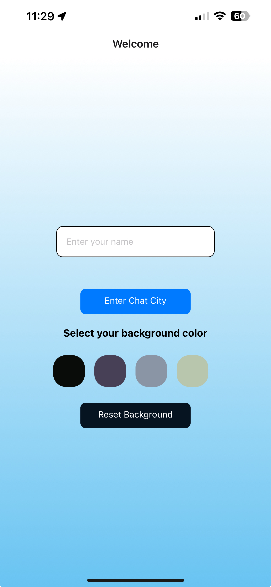
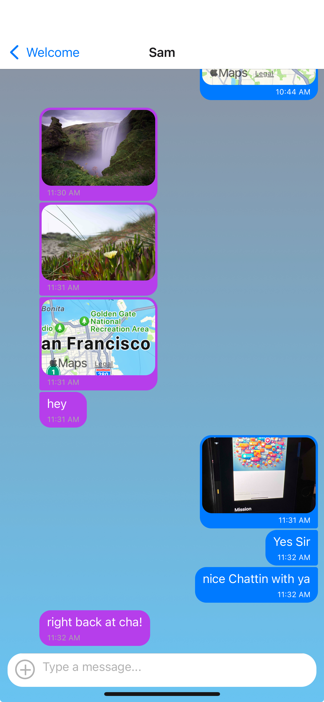

# Chat City - Mobile Chat App: Your Ultimate Communication Companion!

## Mission

Embark on a thrilling journey to revolutionize mobile communication with our Chat App! Built with React Native, this app is your ticket to instant, seamless communication. Share your thoughts, images, and even your location with just a few taps!

## The New Era of Mobile Communication

As the world goes mobile, we're right there with it! From shopping to scheduling, our phones have become our lifelines. Our project harnesses the power of React Native, a cutting-edge framework for crafting Android and iOS apps, to bring you a chat app that's not just a tool, but a game-changer. Showcase your JavaScript mobile development prowess with this addition to your portfolio.

## Your Journey with Us

- **New User? No Problem!** Jump right into the action with our easy-to-use chat rooms. Start connecting with your loved ones in no time!
- **Stay Connected:** Keep up with the latest news by sending messages to your friends and family.
- **Share Your World:** Send images to your friends and let them in on your adventures.
- **Location Sharing:** Let your friends know where the fun's at by sharing your location.
- **Offline Access:** Reread your favorite conversations anytime, anywhere, even offline!
- **Inclusive Design:** We believe in communication for all. Our app is fully compatible with screen readers for visually impaired users.

## Exciting Features

- **Personalized Experience:** Enter your name and choose a background color for your chat screen before you dive into the conversation.
- **Engaging Interface:** Enjoy our user-friendly conversation page, complete with an input field and submit button.
- **More than Words:** Our chat lets you express yourself with images and location data, in addition to text.
- **Always Available:** Your data is stored both online and offline for uninterrupted access.
- **Tap & Hold to Copy or Select with All option to Delete with Share feature:** Industry Standard ability to tap & hold to delete or copy messages.

## Tech Stack

- **React Native:** Our app is built with this innovative framework.
- **Expo:** We use Expo for the development process.
- **Stylish Design:** Our app is styled to match the given screen design.
- **Google Firestore Database:** All chat conversations are securely stored here.
- **Google Firebase Authentication:** We ensure anonymous user authentication.
- **Local Storage:** Chat conversations are stored locally for offline access.
- **Image Sharing:** Pick and send images from your phone’s library or take fresh ones with your device’s camera.
- **Firebase Cloud Storage:** All images are stored securely in Firebase Cloud Storage.
- **Location Data:** Share your location via the chat in a map view.
- **Gifted Chat Library:** We use this library to create our chat interface and functionality.
- **Well-Documented:** Our codebase is thoroughly commented for easy understanding.

## Setup Instructions

Follow these steps to get the app running on your local machine:

1. **Clone the repository:** Use the command https://github.com/timone019/chat-app.git to clone the repository to your local machine.

2. **Navigate to the project directory:** Use the command `cd your-repo-name` to navigate into the root directory of the project.

3. **Install Node.js and npm:** If you don't have Node.js and npm installed, you can download them from [here](https://nodejs.org/en/download/).

4. **Install Expo CLI:** Use the command `npm install -g expo-cli` to install Expo CLI globally on your machine.

5. **Install dependencies:** Use the command `npm install` to install all the necessary dependencies for the project.

6. **Start the app:** Use the command `npx expo start` or `npm start` or `expo start` to start the app. This will open a new browser window with the Expo developer tools.

7. **Run the app on your device/emulator:** You can either use an Android/iOS emulator or directly run the app on your mobile device using the Expo Go app. Scan the QR code displayed in the Expo developer tools with the Expo Go app to run the app on your device.

Please note that you'll need to have the Expo Go app installed on your device to run the app. You can download it from the [App Store](https://apps.apple.com/app/apple-store/id982107779) or [Google Play Store](https://play.google.com/store/apps/details?id=host.exp.exponent&referrer=www).

Remember to replace `your-repo-name` with the actual URL and name of your repository.